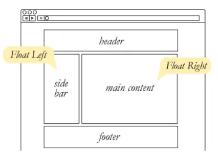

# Responsive Web Design:
is the practice of building a website suitable to work on every device and every screen size, no matter how large or small, mobile or desktop. Responsive web design is focused around providing an intuitive and gratifying experience for everyone. Desktop computer and cell phone users alike all benefit from responsive websites.

## vs Adaptive & vs Mobile:

Responsive and adaptive web design are closely related, and often transposed as one in the same. Responsive generally means to react quickly and positively to any change, while adaptive means to be easily modified for a new purpose or situation, such as change. With responsive design websites continually and fluidly change based on different factors, such as viewport width, while adaptive websites are built to a group of preset factors. A combination of the two is ideal, providing the perfect formula for functional websites. Which term is used specifically doesn’t make a huge difference.

Mobile, on the other hand, generally means to build a separate website commonly on a new domain solely for mobile users. While this does occasionally have its place, it normally isn’t a great idea. Mobile websites can be extremely light but they do come with the dependencies of a new code base and browser sniffing, all of which can become an obstacle for both developers and users.

# What is float :

Float is a CSS positioning property. To understand its purpose and origin, we can look to print design. In a print layout, images may be set into the page such that text wraps around them as needed. This is commonly and appropriately called “text wrap”. Here is an example of that.
In page layout programs, the boxes that hold the text can be told to honor the text wrap, or to ignore it. Ignoring the text wrap will allow the words to flow right over the image like it wasn’t even there. This is the difference between that image being part of the flow of the page (or not). Web design is very similar.
What are floats used for?
Aside from the simple example of wrapping text around images, floats can be used to create entire web layouts.
Floats are also helpful for layout in smaller instances.

## Problems with Floats:

Floats often get beat on for being fragile. The majority of this fragility comes from IE 6 and the slew of float-related bugs it has. As more and more designers are dropping support for IE 6, you may not care, but for the folks that do care here is a quick rundown.

 
 

# SMACSS 
is more style guide than rigid framework. SMACSS is a way to examine your design process and as a way to fit those rigid frameworks into a flexible thought process. It is an attempt to document a consistent approach to site development when using CSS.

At the very core of SMACSS is categorization. By categorizing CSS rules, we begin to see patterns and can define better practices around each of these patterns.

So there are five types of categories:

 ## 1. Base:
A rule is applied to an element using an element selector, a descendent selector, or a child selector, along with any pseudoclasses. It doesn’t include any class or ID selectors. It is defining the default styling for how that element should look in all occurrences on the page.
Base styles include setting heading sizes, default link styles, default font styles, and body backgrounds. There should be no need to use !important in a Base style.

## 2. Layout:
CSS, by its very nature, is used to lay elements out on the page. However, there is a distinction between layouts dictating the major and minor components of a page. The minor components—such as a callout, or login form, or a navigation item—sit within the scope of major components such as a header or footer.
Layout styles can also be divided into major and minor styles based on reuse. Major layout styles such as header and footer are traditionally styled using ID selectors but take the time to think about the elements that are common across all components of the page and use class selectors where appropriate.

## 3. Module:
witch is a more discrete component of the page. It is your navigation bars and your carousels and your dialogs and your widgets and so on. This is the meat of the page. Modules sit inside Layout components. Modules can sometimes sit within other Modules, too. Each Module should be designed to exist as a standalone component. In doing so, the page will be more flexible. If done right, Modules can easily be moved to different parts of the layout without breaking.
When defining the rule set for a module, avoid using IDs and element selectors, sticking only to class names. A module will likely contain a number of elements and there is likely to be a desire to use descendent or child selectors to target those elements.

## 4. State:
witch is something that augments and overrides all other styles. For example, an accordion section may be in a collapsed or expanded state. A message may be in a success or error state.
States are generally applied to the same element as a layout rule or applied to the same element as a base module class.

## 5. Theme:
Theme Rules aren’t used as often within a project and because of that I was quite reluctant to include them as their own category. Some projects do have a need for them, though, as we did when working on Yahoo! Mail.
It is probably self-evident but a theme defines colours and images that give your application or site its look and feel. Separating the theme out into its own set of styles allows for those styles to be easily redefined for alternate themes. The need for theming within a project is necessary when you want the user to receive an alternate skin that provides some cosmetic alterations.

 
 

I think its enogh to 4 you today..

**always** you can contact me [Here](https://3madov-77.github.io/Side-Projects/Me/index.html)

 
 
 
 

[`Back To The Main Page`](https://3madov-77.github.io/Reading-Notes/)
